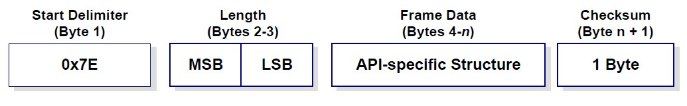

# Digi XBee API

A small collection of C and Python utilities for working with Digi XBee modules in point-to-point communications. Provides lightweight tools to develop and test XBee-based projects using API operating mode.

[xbee-python](https://github.com/digidotcom/xbee-python), [xbee_ansic_library](https://github.com/digidotcom/xbee_ansic_library) and [xbee-c-library](https://github.com/felixgalindo/xbee_c_library) were used for reference and examples.

**API frame structure:**
<!--  -->


## Repository Layout

- **`xbee/src/`**: Core sources for the small xbee wrapper.
- **`xbee/utils/`**: Utility programs, tests and examples.
- **`xbee/utils/xbee_ansic_library/`**: Official ANSI C XBee library for communicating in API mode
- **`xbee/utils/xbee_c_library/`**: Third-party C XBee library that abstracts AT commands and API frames.
- **`xbee/lib/`**: Precompiled static/dynamic libraries.

## Overview of the XBee Functions/Methods

- **`TODO`**: ToDo.

## Usage Example

**C/C++**:
```C
#include "sci.h"
#include "xbee.h"

/* Example PAN command (ID param) */
static const uint8_t pan_param[2] = {0x12, 0x34};

/* Example destinations: broadcast */
static const uint8_t dest_64[8] = {0, 0, 0, 0, 0, 0, 0xFF, 0xFF};
static const uint8_t dest_16[2] = {0xFF, 0xFE};

/* Example payload */
static const uint8_t data[] = {0xAA, 0x01, 0x02, 0x03};

int main(void)
{
    uint8_t c;

    /* Send initial AT command to set PAN ID */
    xbee_send_at("ID", pan_param, 2, 0x01);
    /* AT Response (0x88) response is asynchronous; parse in main loop */

    while (1)
    {
        /* Try to read and parse incoming frames from UART */
        while (sciIsRxReady(sciREG)) // Check if data is available
        {
            c = sciReceiveByte(sciREG); // Read byte from UART
            xbee_rx(c);                 // Feed byte to XBee parser
        }

        /* Periodically send telemetry */
        xbee_tx(dest_64, dest_16, data, sizeof(data));
        printf("Telemetry packet sent\n");

        /* Delay loop */
        for (volatile int i = 0; i < 1000000; i++)
            ;
    }

    return 0;
}
```

**Python**:

```python
import argparse
import logging

logging.basicConfig(
    level=logging.INFO,
    format="%(asctime)s [%(levelname)s] %(message)s",
    datefmt="%H:%M:%S",
)

xbee = XBee(port="/dev/ttyUSB0", baud=115200, rx_mode="sync", tx_mode="sync")
xbee.start()
print("Listening for incoming telemetry (loopback). Ctrl-C to stop.")

try:
    while True:
        message = xbee.rx(timeout=1.0)
        if message is None:
            continue

        timestamp = time.strftime(
            "%Y-%m-%d %H:%M:%S", time.gmtime(message.timestamp_utc)
        )
        print(
            f"[{timestamp}] "
            # f"From {message.source_64bit} RSSI={message.rssi} "
            f"From {DEFAULT_REMOTE_64BIT_ADDRESS} RSSI={message.rssi} "
            f"len={len(message.payload)} payload={message.payload_hex}"
        )

        xbee.tx(message.payload, timeout=1.0)
except KeyboardInterrupt:
    print("Exiting")
finally:
    xbee.stop()
```
